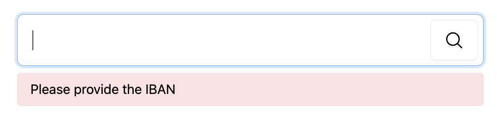

# Virtual Card
Enable the customer to create a virtual credit card.

Acceptance criteria
1. Create a new page for card creation and display:
- With the "Create new card" button


2. Create a new item within the main navigation
- With the name "Virtual card"
- Navigates to the new page


3. Display a new card below the button
- Ask VISA SDK to create a new card
  (see integration specification)
- Display the card below the button
    - Card number formatted with a space after every 4th digit
      1234 5678 9011 1213
    - Card due date formatted as MM/YY
      05/25


4. Display important information below the card
- When the user submits the form

Important
Virtual card is for a single use only (e.g., for secure online shopping). It is automatically destroyed after successful purchase.

Design
New menu item


New page


Integration specification
The card is created by VISA SDK. It's already used somewhere else within our app. We just have to call a specific function they provide.

Copy/pasting details from their documentation:

Public interfaces
export function createVirtualCreditCard(): Promise<CreditCard>;

export type CreditCard = {
id: number;
holder: string;
expiry: Date;
cvc: number;
color?: string;
};
Usage
import { createVirtualCreditCard, CreditCard } from 'visa-client';

const card: CreditCard = await createVirtualCreditCard();
Output sample
{
"id": 1234567890111213,
"holder": "Nik Sumeiko",
"expiry": 2025-05-21T15:27:03.885Z,
"cvc": 123,
"color": "red"
}

# IBAN Validation

Overview
Enable the user to explore IBAN details or provide feedback when the IBAN is invalid.

Acceptance criteria
1. Create a page with the form:
- IBAN input field
- Validate button


2. Send IBAN to the API
   When the user submits the form


3. Display valid IBAN details
- Validation states (based on flags from API response)
- - "Valid IBAN" when the response is successful
- - "Trusted bank" when bank.trustScore is over 7
- - "Accepts instant payments" when flags include INSTANT
- - "Positive operation history" when flags include POSITIVE_HISTORY
- - "No security claims" when flags miss SECURITY_CLAIMS
- - "Complies with Payment Services Directive (PSD2)" when flags include PSD2


4. Display invalid state when IBAN is invalid
- - When API throws — the IBAN is invalid
- - When a response is successful, the given IBAN is valid.

Design
Successful IBAN validation


Invalid IBAN


API specification
The validation is created via GET /validate endpoint.

Expected request:

Attribute	Type
iban	string
Response:

Attribute	Type
iban	string
flags	enum[]
INSTANT | POSITIVE_HISTORY | SECURITY_CLAIMS | PSD2
bank?.trustScore?	number(0-10)
Test data
- AT0309000000000019176655
- RO23INGB0001000000000222
- CZ3608000000002996530173

5. Display formatted IBAN
- Insert space after every 4th character
- Example:
- - Pure: AT0309000000000019176655
- - Formatted: AT03 0900 0000 0000 1917 6655

6. Overview
Provide the user with feedback when the IBAN is missing.

    Acceptance criteria
    1. Display validation message when IBAN is missing


7. Overview
   Enable the user to see the bank IBAN belongs to.

Acceptance criteria
1. Display bank details
- Join bank.name and bank.address using , (comma) separator
- Join bank address parts using , (comma)
- Join city and zip using   (space)

(Consider the bank.name and all address details are optional API response attributes)

Example:

Erste Bank, Am Belvedere 1, 1100 Vienna, AT
^name       ^street         ^zip ^city   ^country


Design
API specification
The validation is created via GET /validate endpoint.

Expected request:

Attribute	Type
iban	string
Response:

Attribute	Type
iban	string
flags	enum[]
INSTANT | POSITIVE_HISTORY | SECURITY_CLAIMS | PSD2
bank?.trustScore?	number(0-10)
bank?.name?	string
bank?.address?.street?	string
bank?.address?.city?	string
bank?.address?.zip?	string
bank?.address?.country?	ISO2(string)
Test data
- HU14116000060000000084586199
- HR8523300033203674306

8. Overview
   Enable the user to see which currency the IBAN supports.

Acceptance criteria
1. Display the currency underneath formatted IBAN


Design
Image

SDK specification
Employ @partner/super-countries JavaScript SDK (from our partner) to retrieve the currency.

Usage:
```
import { findCountryByIso2Code } from '@partner/super-countries';

const { currency } = await findCountryByIso2Code('AT');

Result:

{
"code": "EUR",
"name": "Euro",
"symbol": "€"
}
```
ℹ Consume country code (e.g., AT) from the bank.address.country attribute in the validation API response.


API specification
The validation is created via POST /validate endpoint.

Expected request:

Attribute	Type
iban	string
Response:

Attribute	Type
iban	string
flags	enum[]
INSTANT | POSITIVE_HISTORY | SECURITY_CLAIMS | PSD2
bank?.trustScore?	number(0-10)
bank?.name?	string
bank?.address?.street?	string
bank?.address?.city?	string
bank?.address?.zip?	string
bank?.address?.country?	ISO2(string)
Test data
- AT0309000000000019176655
- GB29NWBK60161331926819
- SA3245000000001123456001
